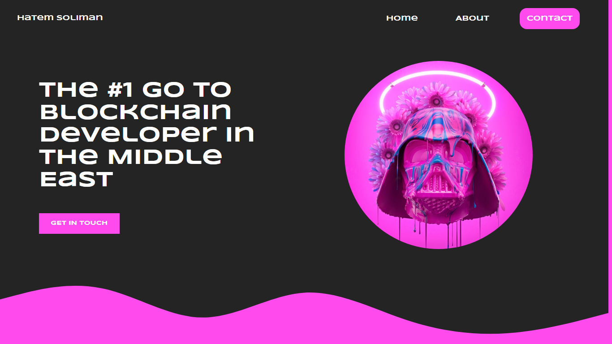

# Project Title

Full Stack Design/Frontend Development Mini Project

## Description

The main purspose for this project was is to put my UX/UI & Frontend skills into test where I'll be creating a simple hero section for a personal website from scratch

## Preview


## Getting Started

### Dependencies

* Figma
* HTML, CSS and Vanilla JavaScript
* Hamburger/cross icon imported from FONTAWESOME


### Installing

* Download the "index" HTML file, "style" CSS file and "app" JavaScript file and the assets folder

### Executing program

* Make sure to download all 3 files mentioned above with the logo and put them in a folder
* Open VSCode and open a new workspace and add that foler you just created.
* Adjust "src" attributes according to your downloaded file locations
* Voila! Run the code and enjoy the functionality!
```
code blocks for commands
```

## Help

Any advise for common problems or issues.
```
command to run if program contains helper info
```

## Authors

Contributors names and contact info

ex. Hatem   
ex. [@codenkoffee](https://www.instagram.com/codenkoffee/)

## Version History

* 0.2
    * Various bug fixes and optimizations
    * See [commit change]() or See [release history]()
* 0.1
    * Initial Release

## License

This project's source code can be used foor personal use or GitHub projects EXCEPT for the Figma Prototyoe. **Skull NFT is not a property of mine; use at your own risk!**

